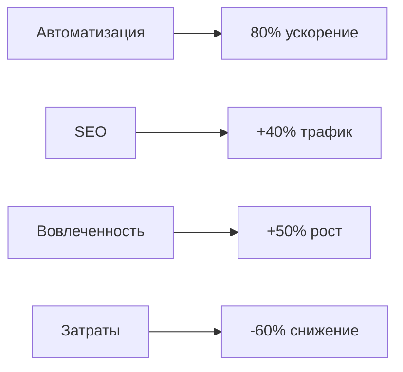
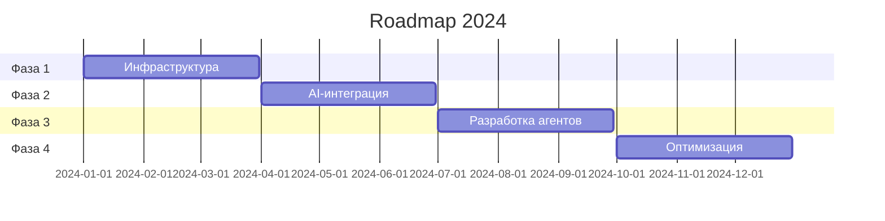

# 🌟 SWARM AI FRAMEWORK - PHUKET.GURU

> 🎯 **Интеллектуальная система управления туристическим контентом**

-------------------

## 📋 ОБЗОР ПРОЕКТА

### Миссия
*Создание передовой системы управления контентом для Phuket.guru, использующей распределенную сеть специализированных ИИ-агентов для автоматизации создания, обновления и оптимизации туристического контента.*

### Ключевые показатели


-------------------

## 🤖 АРХИТЕКТУРА AI-АГЕНТОВ

### Основные агенты

<table>
<tr>
    <th>Агент</th>
    <th>Платформа</th>
    <th>Функции</th>
</tr>
<tr>
    <td>📝 Content Creator</td>
    <td>OpenAI + Claude</td>
    <td>
        • Генерация контента<br>
        • SEO-оптимизация<br>
        • Форматирование
    </td>
</tr>
<tr>
    <td>🔍 Fact Checker</td>
    <td>Peerplexity AI</td>
    <td>
        • Верификация данных<br>
        • Актуализация информации<br>
        • Проверка источников
    </td>
</tr>
<tr>
    <td>🌐 Translator</td>
    <td>Gemini</td>
    <td>
        • Перевод контента<br>
        • Локализация<br>
        • Культурная адаптация
    </td>
</tr>
<tr>
    <td>📊 Analytics</td>
    <td>Crew AI</td>
    <td>
        • Анализ метрик<br>
        • Оптимизация контента<br>
        • Отчетность
    </td>
</tr>
</table>

-------------------

## 🛠️ ТЕХНИЧЕСКИЙ СТЕК

### Инфраструктура
```yaml
Cloud:
  - AWS EC2
  - Kubernetes
  - Docker

Backend:
  - Python 3.9+
  - FastAPI
  - AsyncIO

Storage:
  - PostgreSQL
  - Elasticsearch
  - Redis

AI/ML:
  - TensorFlow 2.x
  - GPT-3
  - BERT

Monitoring:
  - ELK Stack
  - Prometheus
  - Grafana
```

-------------------

## 📊 МЕТРИКИ ЭФФЕКТИВНОСТИ

### Производительность системы

```
Скорость генерации:    ██████████ 100%
Точность перевода:     ████████░░  80%
SEO-оптимизация:       ███████░░░  70%
Качество контента:     █████████░  90%
```

### KPI

| Метрика | Цель | Срок |
|---------|------|------|
| Время создания статьи | < 10 мин | Q1 2024 |
| Точность перевода | > 99% | Q2 2024 |
| Рост трафика | +40% | Q3 2024 |
| Конверсия | +25% | Q4 2024 |

-------------------

## 🔐 БЕЗОПАСНОСТЬ

### Меры защиты

<details>
<summary>Основные механизмы безопасности</summary>

* 🔒 End-to-end encryption
* 🔑 OAuth 2.0
* 🛡️ DDoS protection
* 📜 GDPR compliance
* 🔍 Audit logging
* 🚫 Rate limiting

</details>

-------------------

## 📈 ПЛАН РАЗВИТИЯ

### Этапы внедрения



-------------------

## 💬 ПОДДЕРЖКА

### Контакты

| Команда | Email | Доступность |
|---------|-------|-------------|
| 👨‍💼 PM | pm@phuket.guru | 24/7 |
| 👨‍💻 Tech | tech@phuket.guru | 09:00-18:00 |
| 🛟 Support | help@phuket.guru | 24/7 |

-------------------

> *⚡ Проект активно развивается. Следите за обновлениями!*
> 
> *Создано с ❤️ командой Phuket.guru*